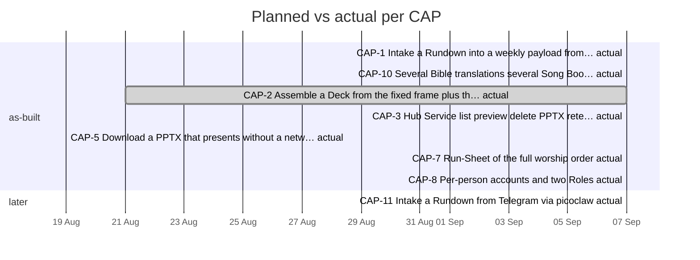

# Timeline

> Generated by `.constitution/method/scripts/timeline.py --generate`. MUST NOT be hand-edited.

As of: **2026-09-17**

## Per CAP

| CAP | Title | Release | Size | Priority | Owner | Planned | Actual | Δ days | State |
|---|---|---|---|---|---|---|---|---|---|
| CAP-1 | Intake a Rundown into a weekly payload from the Hub form | as-built | — | must | — | — → — | 2026-09-07 → 2026-09-07 | — | done |
| CAP-10 | Several Bible translations, several Song Books, two language axes | as-built | — | must | — | — → — | 2026-09-07 → 2026-09-07 | — | done |
| CAP-11 | Intake a Rundown from Telegram via picoclaw | later | — | must | — | — → — | 2026-09-07 → 2026-09-07 | — | done |
| CAP-2 | Assemble a Deck from the fixed frame plus the weekly payload | as-built | — | must | — | — → — | 2026-08-21 → 2026-09-07 | — | done |
| CAP-3 | Hub Service list, preview, delete, PPTX retention | as-built | — | must | — | — → — | 2026-09-07 → 2026-09-07 | — | done |
| CAP-4 | Edit Service fields and regenerate in place | as-built | — | must | — | — → — | 2026-09-07 → — | — | in-progress |
| CAP-5 | Download a PPTX that presents without a network | as-built | — | must | — | — → — | 2026-08-19 → 2026-08-19 | — | done |
| CAP-6 | Present in the browser — slideshow, presenter, on-demand verse | as-built | — | must | — | — → — | 2026-08-22 → — | — | in-progress |
| CAP-7 | Run-Sheet of the full worship order | as-built | — | must | — | — → — | 2026-09-07 → 2026-09-07 | — | done |
| CAP-8 | Per-person accounts and two Roles | as-built | — | must | — | — → — | 2026-09-07 → 2026-09-07 | — | done |
| CAP-9 | Artifact Registry — Deck layout and order | as-built | — | must | — | — → — | 2026-08-19 → — | — | in-progress |
