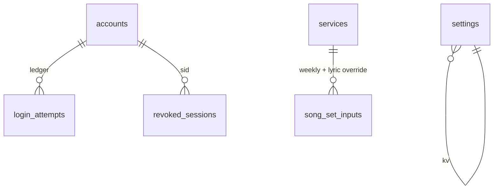
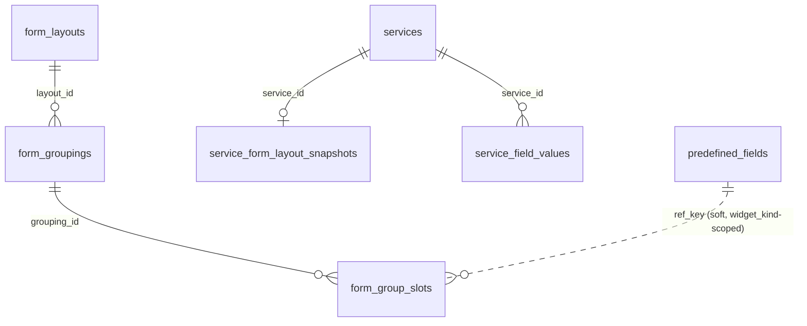

# Model — Hub (physical)

Source: `src/lib/db/index.ts` startup DDL. [verified], including `song_set_inputs` (DEC-004).

## Entities

| Entity | Table | Identified by |
| --- | --- | --- |
| Service | `services` | `id` |
| Song Set Weekly Input / Lyric Override | `song_set_inputs` (DEC-004) | `(service_id, variable_name)` |
| Account | `accounts` | `id` / `username` |
| AppSetting | `settings` | `key` |
| Hymn (corpus) | `hymns` | `(book_code, number)` |

**`AnnouncementItem` / `announcement_items` is retired from Hub's domain (DEC-004, FR-3 retired).**
The table's physical fate is a build-time decision, not decided here — see *Retirement of
`announcement_items`* below; it MUST NOT be dropped before the residual-reuse caution in that section
is satisfied.

## Relationships

One Service has zero or many uploads in the JSON payload and zero or one `song_set_inputs` row per
Song Set entry the Registry currently defines (`variable_name` is a soft reference — no `FOREIGN KEY`
to a Registry table, since the entry list is Registry-owned data in a different table family;
`ON DELETE CASCADE` still applies to `service_id`). One Account one role.

## Data dictionary

| Table | Column | Type | Meaning |
| --- | --- | --- | --- |
| services | id | INTEGER PK | Service row identity |
| services | date | TEXT | Worship date `YYYY-MM-DD` |
| services | raw_payload | TEXT | Raw Rundown |
| services | parsed_data | TEXT | Parser-result JSON |
| services | images_payload | TEXT | Events image-URL JSON |
| services | participants_payload | TEXT | Role JSON |
| services | created_at | DATETIME | Row created time |
| services | updated_at | DATETIME | AD-6 precondition |
| services | registry_snapshot_at | TEXT | When this Service last cloned the live registry (AD-16) |
| hymns | id | INTEGER PK | Hymn row identity |
| hymns | book_code | TEXT | Book key (AD-26) |
| hymns | number | INTEGER | Number in that book |
| hymns | title | TEXT | Hymn title in the Song Book |
| hymns | lyrics | TEXT | Verse/refrain lyrics; the "Save to Song Book" action (UC-28) is the only planned write path here besides the bootstrap-once loader — see *Migration* below (AD-36) |
| song_set_inputs | service_id | INTEGER, FK → services.id ON DELETE CASCADE | Owning Service |
| song_set_inputs | variable_name | TEXT | Which Song Set entry this row is for (Registry-owned identity, DEC-004 Supplement S2); soft reference, not a DB foreign key |
| song_set_inputs | song_number | INTEGER NULL | This week's hymn number for the entry (FR-32) |
| song_set_inputs | song_book_code | TEXT NULL | This week's Song Book choice; null falls back to `settings.default_song_book` (Supplement S3) |
| song_set_inputs | background_id | TEXT NULL | This week's Verse/Reff background choice from the Background Library; null falls back to the Admin global default (Supplement S4); never the **live** override, which AD-34 keeps unpersisted |
| song_set_inputs | lyric_override | TEXT NULL | This Service's edited lyric text (FR-34); null = untouched, falls through to `hymns.lyrics` (BR-7) |
| song_set_inputs | updated_at | TEXT | Optimistic concurrency token, same discipline as the rest of the Service row (AD-6) |
| ~~announcement_items~~ | ~~id~~ | ~~INTEGER PK~~ | Retired from Hub's write paths (DEC-004); table's physical fate below |
| accounts | id | INTEGER PK | Account identity |
| accounts | username | TEXT UNIQUE | Sign-in name |
| accounts | password_hash | TEXT | Password hash |
| accounts | role | TEXT | `admin` \| `operator` |
| accounts | token_version | INTEGER | Revoke session |
| accounts | created_at | DATETIME | Row created time |
| login_attempts | id | INTEGER PK | Ledger row |
| login_attempts | scope | TEXT | `user-ip` \| `ip` |
| login_attempts | key | TEXT | Lockout-window key |
| login_attempts | attempted_at | INTEGER | unix s |
| revoked_sessions | sid | TEXT PK | Revoked session id |
| revoked_sessions | expires_at | INTEGER | End of revocation |
| settings | key | TEXT PK | including `slide_transition`, `ui_locale`, `data_version` |
| settings | value | TEXT | Settings string value |

## Invariants

- `UNIQUE(book_code, number)`
- `PRIMARY KEY (service_id, variable_name)` on `song_set_inputs` — one row per entry per Service, upsert not insert
- Deleting a Service cascades `song_set_inputs` — same `ON DELETE CASCADE` shape as the retired `announcement_items.service_id`
- Schema only through startup DDL (AD-9); `song_set_inputs` is a **numbered migration** (AD-21), never a reseed (AD-17) — existing Services get empty rows, not a synthetic backfill, except the one Family/Youth/song-number JSON-key migration named below, which is a normalize-on-read change to the *contents* of `parsed_data`, not a schema migration

## Migration — `song_set_inputs` (new table, DEC-004 / FR-32 / FR-34)

`CREATE TABLE IF NOT EXISTS song_set_inputs` per the dictionary above, at the next startup-DDL
version (AD-9, AD-21). **Assumption (smallest reasonable choice, not owner-confirmed):** existing
Services' four positional hymn overlays (`song1Number`..`song4Number`, embedded today as `hymn` items
in `parsed_data.items` rather than a named column — see `worship-form-fields.ts`) are, on this same
migration, copied one-time into four rows keyed by the seed's default `variable_name`s
(`opening_song_bt`, `closing_song_bt`, `opening_song_dw`, `closing_song_dw` — DEC-004 Supplement S2's
named default seed). If the Registry has not seeded those exact four names by the time this migration
runs, the copy is a no-op and existing Services simply start with no Song Set Weekly Input rows — never
a crash, per AD-17's fail-closed posture for a gap in existing data.

## Migration — Family/Youth split and Scripture/Theme (DEC-004 Supplement S1)

`parsed_data` is a schemaless JSON blob (`services.parsed_data TEXT`) — the precedent for evolving its
shape is already **normalize-on-read**, not a DDL migration: `normalizeParsedRundown()` already carries
the legacy combined `familyYouth` text forward into `familyPrayerRequest` when the split fields are
empty. The same pattern extends here, not a new mechanism:

- `familyYouth` (legacy combined) → `family_request` (renamed target of `familyPrayerRequest`) as-is,
  exactly once, the first time a row is read after this change ships; `family_name` starts empty (no
  source value ever existed for it — DEC-004 Supplement S1).
- `youthPrayerRequest` renames to `youth_request` the same way; `youth_name` starts empty.
- `scripture_bible_version` is **not** a new key to invent — it already exists as-built,
  `verseReading.translation` (`ParsedScripture.translation` / form field `verseTranslation`). DEC-004
  Supplement S1 calls it new; that claim does not match the code read for this SDD (`src/lib/parsed-fields.ts`
  `coerceScripture`, `src/lib/worship-form-fields.ts` `verseTranslation`) and is corrected here rather
  than repeated. Only the catalog **key name** changes (`verseTranslation` → `scripture_bible_version`
  as the Predefined Field token), not the underlying field.
- `theme_reference` / `theme_text` are already independent of `scripture_reference` / `scripture_text`
  as-built (`parsed.themeVerse` is its own `ParsedScripture`, separate from `parsed.verseReading`) — no
  migration needed there; DEC-004's "split" language describes work already done.

## Retirement of `announcement_items`

Hub's write paths onto this table retire with FR-3 (contract: `02-contracts/03-announcements.md`).
**The table itself MUST NOT be dropped in the same change that retires the API.** The residual
responsibility DEC-004 calls out — weekly image *asset reuse* must survive — sits entirely with the
**image files on disk** (`/api/uploads/<32-hex>.(jpg|jpeg|png|gif|webp)`, AD-8), not with this table's
rows: those files are unaffected by anything here, and the Registry's Announcement Set canvases can
reference the same URLs directly (an image Predefined Field / manual image element pointing at an
existing upload) with no re-upload. What the table's rows carried — which flyer belonged to which
week, in what order — has no automatic transform into Registry Announcement Sets; an Admin re-authors
that structure by hand in the Registry, optionally picking the same already-uploaded image. Once that
one-time re-authoring is done and confirmed, a later numbered migration (AD-21) may drop the table;
until then it is dead but harmless, and Hub's delete-Service cascade (`06-flows/delete-service.md`)
must stop touching it the moment the API retires, so a deleted Service does not silently remove rows
an Admin has not yet migrated off of.

## Resolved — AD-25 vs. "Save to Song Book" (FR-34, UC-28), closed by DEC-005 / AD-36

AD-25 used to state there was **no** administrator or operator write path into a corpus table, and
that adding one "reopens this decision before it ships." DEC-004 Supplement S12 requires exactly that
write path into `hymns.lyrics`. This conflict is now closed: the owner ratified (2026-08-20) that the
song book becomes administrator-owned data after a one-time bootstrap, recorded in **DEC-005** and
landed as the living rule **AD-36**, which supersedes AD-25 in part — the song-book half only. The
bible family (`bible_verses`, `bible_books`, `bible_translations`, `bible_book_names`) stays fully
under AD-25, unaffected.

**Consequence for this table.** `hymns` is no longer a projection of `data/song-book/*.json` once a
book's rows have been bootstrapped: `upsertHymns` must become insert-only-for-absent-rows, gated by a
per-book-code marker (AD-36), so the `save-to-book` write survives a restart instead of being
overwritten by the next boot's reconcile. Build MUST land that bootstrap-once change in the same
numbered `data_version` migration (AD-21) that ships the `save-to-book` route — see
`06-flows/lyric-save-to-book.md` § *Migration* for the exact step. Until that migration lands, the
route MUST NOT ship: shipping the write path first, with the old unconditional reconcile still
running, would silently discard the Operator's correction on the very next restart.

## New tables (2026-09-22 backfill — FR-36, FR-37, FR-40)

| Entity | Table | Identified by |
| --- | --- | --- |
| Rundown Parser Profile | `rundown_parser_profiles` | `id` / `slug` |
| Form Layout | `form_layouts` | `id` |
| Form Grouping | `form_groupings` | `id` |
| Form Grouping Slot | `form_group_slots` | `id` |
| Predefined Field | `predefined_fields` | `id` / `variable_name` |
| Service Field Value | `service_field_values` | `(service_id, variable_name)` |
| Service Form Layout Snapshot | `service_form_layout_snapshots` | `service_id` |

**Relationships.** One Form Layout has zero or many Form Groupings, ordered by `sort_order`
(`UNIQUE(layout_id, sort_order)`). One Form Grouping has zero or many Form Grouping Slots, ordered
the same way. A Form Grouping Slot's `ref_key` is a soft reference (no `FOREIGN KEY`) scoped by its
own `widget_kind` — `predefined_field` (this table), `song_set_entry` (Registry's
`song_set_entries.variable_name`), or `announcement_slot` — the same one-table-two-owners shape
`song_set_inputs.variable_name` already has for the Registry's Song Set entries.
`UNIQUE(layout_id, widget_kind, ref_key)` prevents the same ref occupying two slots in one layout. A
Service has zero or one Service Form Layout Snapshot, taken in the same transaction as Service
creation (`internal/httpapi/services.go:202`), and zero or many Service Field Values, one per
Predefined Field entered on it.

| Table | Column | Type | Meaning |
| --- | --- | --- | --- |
| rundown_parser_profiles | id | TEXT PK | Profile identity |
| rundown_parser_profiles | slug | TEXT UNIQUE | URL/reference-safe name |
| rundown_parser_profiles | title, description | TEXT | Admin-facing labels |
| rundown_parser_profiles | rules_json | TEXT | The extraction rule set `internal/parse` applies |
| rundown_parser_profiles | is_builtin | INTEGER | 1 for the shipped default; MUST NOT be deleted |
| rundown_parser_profiles | is_default | INTEGER | Exactly one row may hold 1 at a time |
| rundown_parser_profiles | version | INTEGER | Bumped on update |
| form_layouts | id | TEXT PK | Layout identity |
| form_layouts | is_active | INTEGER | The Service form renders whichever layout holds 1; falls back to `id = 'default-layout'` if none does |
| form_groupings | id | TEXT PK | Grouping identity |
| form_groupings | layout_id | TEXT, FK → form_layouts.id ON DELETE CASCADE | Owning layout |
| form_groupings | sort_order | INTEGER | Position within the layout |
| form_group_slots | id | TEXT PK | Slot identity |
| form_group_slots | layout_id | TEXT, FK → form_layouts.id ON DELETE CASCADE | Denormalized for the `UNIQUE(layout_id, widget_kind, ref_key)` constraint |
| form_group_slots | grouping_id | TEXT, FK → form_groupings.id ON DELETE CASCADE | Owning grouping |
| form_group_slots | widget_kind | TEXT | `predefined_field` \| `song_set_entry` \| `announcement_slot` |
| form_group_slots | ref_key | TEXT | The referenced entity's own key, meaning depends on `widget_kind` |
| predefined_fields | id | TEXT PK | Field identity |
| predefined_fields | variable_name | TEXT UNIQUE | `/^[a-z][a-z0-9_]{1,63}$/`, the cross-boundary key (DEC-058) |
| predefined_fields | field_type | TEXT | `text` \| `text_area` \| `image` |
| predefined_fields | is_system | INTEGER | Marks a shipped default field |
| predefined_fields | is_active | INTEGER | 0 = soft-deleted; the row survives so no `service_field_values` row orphans |
| service_field_values | service_id | TEXT, FK → services.id ON DELETE CASCADE | Owning Service |
| service_field_values | variable_name | TEXT | Which Predefined Field, soft reference |
| service_field_values | value_text | TEXT | The entered value |
| service_form_layout_snapshots | service_id | TEXT PK, FK → services.id ON DELETE CASCADE | One per Service |
| service_form_layout_snapshots | layout_version | INTEGER | Which Form Layout version was frozen |
| service_form_layout_snapshots | snapshot_json | TEXT | The frozen layout structure |

**Invariants.** `UNIQUE(layout_id, sort_order)` on `form_groupings`; `UNIQUE(grouping_id, sort_order)`
and `UNIQUE(layout_id, widget_kind, ref_key)` on `form_group_slots`; `UNIQUE(variable_name)` on both
`rundown_parser_profiles` (as `slug`) and `predefined_fields`. Deleting a Predefined Field is a soft
delete (`is_active = 0`, `deletePredefinedField`) — no cascade to `service_field_values`, matching
BR-15. Deleting a built-in or the active default parser profile is refused, not cascaded.

## Physical notes

One SQLite file `DB_PATH`, WAL, `busy_timeout` 5000, FK on. Not a separate container.
