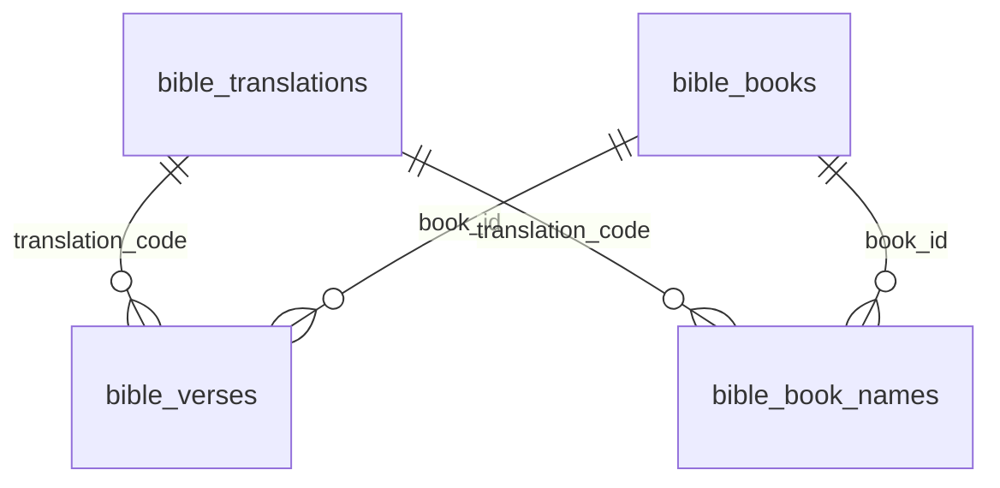

# Model — Presenter (physical)

Presenter **does not write** these tables. Boot reconcile (AD-25) writes them.

## Entities

| Entity | Table | Identified by |
| --- | --- | --- |
| BibleTranslation | `bible_translations` | `code` |
| BibleBook | `bible_books` | `id` 1..66 |
| BibleVerse | `bible_verses` | `(book_id, chapter, verse, translation_code)` |

## Data dictionary

| Table | Column | Type | Meaning |
| --- | --- | --- | --- |
| bible_translations | code | TEXT PK | AD-26 key |
| bible_translations | name | TEXT | Translation display name |
| bible_translations | locale | TEXT | Attribute, not a key |
| bible_translations | licence | TEXT | Corpus licence |
| bible_translations | provenance | TEXT | File origin |
| bible_translations | content_hash | TEXT | Detect file vs table drift |
| bible_books | id | INTEGER PK | Canonical identity |
| bible_books | name | TEXT | Global fallback name, used only when a translation has no rows in `bible_book_names` |
| bible_books | short_name | TEXT | same |
| bible_book_names | translation_code | TEXT PK (composite) | AD-27: per-translation book name, FK to `bible_translations.code` |
| bible_book_names | book_id | INTEGER PK (composite) | FK to `bible_books.id` |
| bible_book_names | name | TEXT | Book name in this translation |
| bible_book_names | short_name | TEXT | same |
| bible_verses | book_id | INTEGER FK | Canonical book |
| bible_verses | chapter | INTEGER | Chapter |
| bible_verses | verse | INTEGER | Verse |
| bible_verses | verse_text | TEXT | Verse content |
| bible_verses | translation_code | TEXT | default KJV |

## Invariants

No write API. File → table reconcile. Per-translation book names live in `bible_book_names`, populated at boot for every installed translation (AD-27); `bible_books.name`/`short_name` remain only as the fallback used when a translation has no rows there.

## Physical notes

Presenter session is not in SQLite (AD-24 ephemeral-shared).
