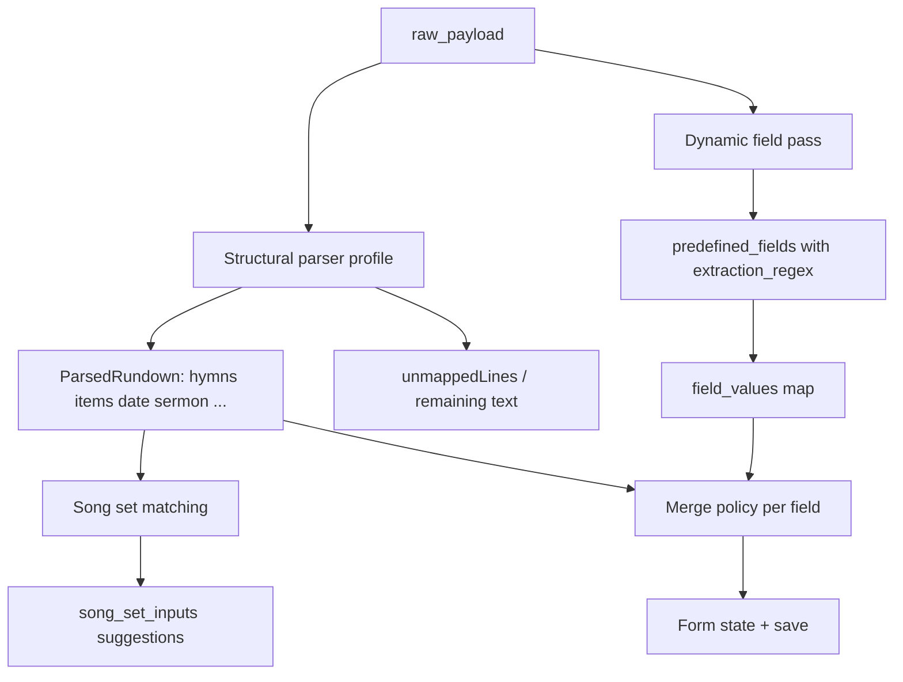

# Evaluasi arsitektur: Configurable Dynamic Layout & Predefined Fields Engine

Visi ini **possible dan feasible** di stack Go + SQLite + React. Repo sudah punya fondasi yang sejalan; yang belum ada adalah **metadata layout form** dan **catalog placeholder yang bisa diperluas per deployment**, sementara banyak lapisan masih **duplikasi hardcoded** (form React, `WorshipFormFields`, `catalogValues()` di Go, dan 17 key tetap di `placeholder-catalog.ts`).

---

## 1. Kelayakan arsitektur (verdict)

**Verdict: layak diimplementasi**, dengan refactor bertahap—not big-bang.

| Sudah ada (bukti di codebase) | Belum ada (gap visi user) |
|---|---|
| Grid atas: rundown kiri (`lg:col-span-7`) + preview kanan (`EditForm.tsx`) | Card di bawah rundown di-hardcode per domain |
| Parser profile DB (`rundown_parser_profiles.rules_json`) + `field_rules` + `song_set_matching` | Field regex per “predefined field” yang owned UI admin, bukan hanya builtin profile |
| `song_set_entries` + `song_set_inputs` per service (DEC-004) | Grouping card + urutan slot configurable |
| Hydration token `{key}` via `map[string]interface{}` (`hydrate.go`, `substituteTokens`) | Catalog dinamis + `catalogValues(c ctx)` masih map dari struct `ctx` tetap |
| `ImageUploadField`, hymn autocomplete, announcement inserts (4 slot) | Satu **form engine** yang merender dari schema |

**Keuntungan vs sistem sekarang**

- Satu sumber kebenaran: `variable_name` → form, parse, dan slide template.
- Gereja lain tanpa fork UI: edit grouping/field, bukan edit `EditForm.tsx`.
- Seeder adaptif menggantikan “hardcoded = forever”.

**Trade-off**

- **Kompleksitas operasional**: admin harus paham regex, collision token, dan hubungan ke Registry/slide spine.
- **Validasi**: template canvas + catalog harus tetap konsisten (hari ini `validate_artifact.go` menolak key di luar catalog tetap).
- **Dua jalur data sementara migrasi**: legacy `parsed_data` + kolom media vs `custom_field_values` baru.
- **Bukan pengganti parser struktural**: hymn, section, date, role lines tetap perlu pipeline parser yang sudah ada; dynamic fields melengkapi/meng-override overlay, bukan mengganti seluruh `ParsedRundown` sekaligus (kecuali fase jauh).

---

## 2. Rancangan data model & schema SQLite

Prinsip: **layout & definisi field = konfigurasi global** (satu congregation per DB, seperti parser profile); **nilai per kebaktian = per service**.

### Tabel konfigurasi (admin)

```sql
-- Satu baris aktif atau versioned; pilih salah satu strategi
CREATE TABLE form_layout_versions (
  id TEXT PRIMARY KEY,
  version INTEGER NOT NULL,
  is_active INTEGER NOT NULL DEFAULT 0,
  created_at TEXT NOT NULL,
  updated_at TEXT NOT NULL
);

CREATE TABLE form_groupings (
  id TEXT PRIMARY KEY,
  layout_id TEXT NOT NULL REFERENCES form_layout_versions(id) ON DELETE CASCADE,
  label TEXT NOT NULL,
  sort_order INTEGER NOT NULL,
  description TEXT NOT NULL DEFAULT ''
);

-- Satu baris = satu “slot” di dalam card
CREATE TABLE form_group_slots (
  id TEXT PRIMARY KEY,
  grouping_id TEXT NOT NULL REFERENCES form_groupings(id) ON DELETE CASCADE,
  sort_order INTEGER NOT NULL,
  slot_kind TEXT NOT NULL CHECK (slot_kind IN (
    'predefined_field', 'song_set_entry', 'announcement_weekly_slot'
  )),
  -- predefined_field → predefined_fields.variable_name
  -- song_set_entry → song_set_entries.variable_name (registry)
  -- announcement_weekly_slot → slot_index 1..4
  ref_key TEXT NOT NULL,
  UNIQUE (grouping_id, sort_order)
);

CREATE TABLE predefined_fields (
  variable_name TEXT PRIMARY KEY,  -- snake_case, dipakai {variable_name} di canvas
  shown_label TEXT NOT NULL,
  field_type TEXT NOT NULL CHECK (field_type IN (
    'text', 'text_area', 'image', 'announcement_slot'
  )),
  visual_props_json TEXT NOT NULL DEFAULT '{}',  -- { "maxLength": 100 } | { "initialLines": 5 }
  extraction_regex TEXT,  -- NULL untuk image / announcement_slot
  extraction_capture TEXT,  -- optional: named group e.g. "value" | "speaker"
  seed_key TEXT UNIQUE,   -- e.g. 'builtin:scripture_reference' untuk seeder adaptif
  is_system INTEGER NOT NULL DEFAULT 0,  -- optional: lindungi hapus field inti
  created_at TEXT NOT NULL,
  updated_at TEXT NOT NULL
);
```

**Catatan desain**

- `announcement_slot` sebagai **tipe field** vs `announcement_weekly_slot` sebagai **slot_kind**: pilih satu model. Rekomendasi: **slot_kind khusus** untuk 4 spine slot (sudah ada `announcementInserts[]`); jangan duplikasi sebagai predefined field kecuali hanya binding UI.
- Song set **tetap** di `song_set_inputs`—jangan masukkan struktur hymn ke EAV; slot form hanya **referensi** `variable_name` registry.

### Nilai per service

**Hybrid (disarankan)**, selaras dengan pola sekarang:

| Data | Penyimpanan |
|---|---|
| Raw rundown | `services.raw_payload` (existing) |
| Hasil parse struktural | `services.parsed_data` (existing, gradually thinner) |
| Song set mingguan | `song_set_inputs` (existing) |
| Gambar sermon/keluarga/pemuda + flyer | `images_payload` / kolom terkait (existing) |
| **Semua predefined field custom + canonical overlay** | **`services.field_values_json`** (baru) — `Record<variable_name, string \| null>` |

Mengapa bukan EAV murni: jumlah field moderate, read/write satu service = satu JSON blob + index opsional; EAV berguna jika nanti perlu query lintas service (“semua kebaktian dengan field X”).

**Adapter legacy (wajib untuk non-regresi)**

Saat load service lama tanpa `field_values_json`:

1. Isi map dari `fieldsFromParsed` + URL gambar + announcement inserts.
2. Map key legacy → catalog canonical (`scripture_reference`, `sermon_speaker_name`, …) sesuai `PLACEHOLDER_CATALOG` hari ini.

Saat save: tulis **map + legacy columns** sampai fase sunset, atau tulis map saja dan biarkan adapter backfill kolom lama untuk consumer lama.

---

## 3. Form engine & rendering React

### Arsitektur

```
FormLayoutSchema (API GET /admin/form-layout/active)
  └── groupings[]
        └── slots[] { kind, refKey, fieldDef? }

RunSheetPage / EditForm
  ├── FixedTop: RundownTextarea + ParserProfileSelect + Parse actions
  ├── FixedTopRight: SlidePreviewList (sticky)
  └── DynamicZone: FormLayoutRenderer
        └── for each grouping → <Card>
              └── for each slot → slotRendererRegistry[kind](props)
```

**Registry renderer (specialized)**

| Slot / type | Komponen |
|---|---|
| `song_set_entry` | Ekstrak blok hymn dari `EditForm` (autocomplete, background, lyric editor, save-to-book) |
| `predefined_field` + `text` | `<Input maxLength={visual.maxLength} />` |
| + `text_area` | `<Textarea rows={visual.initialLines} />` |
| + `image` | `<ImageUploadField />` layout 3 kolom (sudah ada) |
| `announcement_weekly_slot` | Input URL/index ke `announcementInserts[n]` |

State: `Record<string, string>` (dan song sets tetap `SongSetInputs`) — ganti `WorshipFormFields` typed fixed.

**Di mana admin mengelola layout?**

- **Admin terpisah** (mis. `/admin/form-layout`, `/admin/predefined-fields`) — mirror pola `/admin` parser profiles.
- **Operator edit** (`RunSheetPage`) hanya **consume** layout aktif; tidak edit schema (hindari kecelakaan saat Minggu Paskah).
- Opsional later: “Customize layout” di admin dengan preview read-only side-by-side.

Validasi client: `variable_name` regex `^[a-z][a-z0-9_]*$`, collision check dengan song set registry names.

---

## 4. Integrasi rundown regex extraction

### Dua lapis (disarankan)



**Mekanisme dynamic pass**

- Untuk setiap field dengan `extraction_regex`: compile (cache), jalankan pada **full raw text** atau **line-by-line** (pilih satu; line-by-line lebih aman untuk ReDoS dan UX).
- Named capture → `extraction_capture` (default `value`) → tulis ke `variable_name` jika form state masih kosong (**parse tidak menimpa edit manual** — sama seperti perilaku Parse hydrate sekarang).

**Hubungan dengan parser profile `field_rules`**

- **Fase 1**: builtin `field_rules` tetap mengisi `ParsedRundown`; adapter sync ke canonical keys di `field_values_json`.
- **Fase 2**: generate/sync `field_rules` dari predefined fields yang punya `seed_key` builtin, atau deprecate duplicate rules dari profile JSON.
- **Jangan** dua regex berbeda untuk key yang sama tanpa dokumentasi precedence: **explicit order**: manual > dynamic field > structural parsed > default.

**Song set matching**

- Tetap **orthogonal** (`song_set_matching.label_slots` → target `variable_name` song set).
- Jalankan setelah structural parse (kandidat lagu dari `items` / labeled lines), **bukan** dari generic text field regex.
- UI “Apply song suggestions” tetap batch; dynamic fields tidak menggantikan hymn line parser.

---

## 5. Slide plan & canvas template hydration

Hari ini alur sudah **token-driven** di artifact level:

```86:104:internal/plan/hydrate.go
func substituteTokens(content string, values map[string]interface{}) string {
	return inlineTokenRegex.ReplaceAllStringFunc(content, func(m string) string {
		// ...
		val, ok := values[token]
		// ...
	})
}
```

Yang **hardcoded** adalah pengisian catalog:

```233:298:internal/plan/plan.go
func catalogValues(c ctx) map[string]interface{} {
	out := map[string]interface{}{}
	// scripture_reference, sermon_speaker_name, family_photo, ...
	return out
}
```

**Target arsitektur**

1. **`predefined_fields`** (+ optional view DB) = sumber catalog untuk validasi template (`validate_artifact.go` / TS mirror).
2. **`BuildCatalogValues(serviceID)`** → baca `field_values_json` + media URLs + `parsed_data` fallback + `service_date`.
3. Ganti `catalogValues(c ctx)` dengan **`catalogValuesFromMap(values map[string]interface{})`**; `ctx` tetap untuk **spine non-catalog** (urutan artifact, hymn groups, announcement spine).
4. Template `Placeholder.Key` dan inline `{token}` **tidak perlu struct Go baru** per gereja—cukup key ada di catalog runtime dan ada nilai string/image di map.

**Reservasi**

- Key **system** untuk song artifacts (`song_number`, `verse_content[]`, dll.) tetap terpisah dari predefined weekly catalog—jangan biarkan admin reuse nama yang bentrok.
- Saat admin menambah field baru, template lama tidak otomatis pakai field itu sampai operator bind token di canvas editor (expected).

---

## 6. Adaptive seeder & migrasi

### Seeder adaptif (idempotent)

```text
Seed Default Predefined Fields:
  FOR each builtin definition D (grouping + fields + seed_key):
    IF NOT EXISTS predefined_fields WHERE seed_key = D.seed_key:
      INSERT field
    IF NOT EXISTS form_groupings/slots for D.layout_seed_key:
      INSERT grouping + slots (only missing slots by seed_key)
  NEVER UPDATE extraction_regex / label on existing rows
  NEVER DELETE user data
```

Tombol bisa menampilkan preview: “Will add 3 fields, 1 grouping, 0 conflicts.”

**Migrasi service existing**

1. Deploy schema + layout v1 yang **mirrors** card order `EditForm` saat ini.
2. Backfill **read-only adapter**—tidak rewrite mass `parsed_data` di migration SQL.
3. Optional one-time job: populate `field_values_json` dari snapshot terakhir untuk simplify read path.
4. **`service_registry_snapshots`** dan plan spine **tidak** bergantung form layout; kebaktian lama tetap render selama field values + parsed_data + song_set_inputs utuh.
5. Version `form_layout_versions`: service **tidak perlu** pin layout kecuali nanti gereja ingin freeze form untuk arsip—default “always active layout” cukup untuk v1.

---

## 7. Roadmap implementasi pragmatis

| Fase | Deliverable | Risiko |
|---|---|---|
| **0 – Spec & DEC** | Model slot kinds, collision rules, merge policy parse, sunset plan untuk `WorshipFormFields` | Scope creep |
| **1 – Schema + admin CRUD** | `predefined_fields`, groupings, slots; seed adaptif; API GET layout | — |
| **2 – Dynamic renderer** | Ganti card hardcoded di `EditForm` dengan renderer; fixed top unchanged | Regresi UX hymn row |
| **3 – `field_values_json` + save/load** | Adapter legacy; `buildFieldsPayload` → generic map | Dual-write bugs |
| **4 – Dynamic catalog di plan** | DB-backed catalog validation + `BuildCatalogValues` | Template warnings |
| **5 – Dynamic regex pass** | UI edit regex; optional sync dari builtin seeder | ReDoS → limit panjang input, timeout compile |
| **6 – Deprecation** | Kurangi `ParsedRundown` overlay fields; parser profile hanya structural | Long tail edge cases |

**Quick win sebelum fase penuh**: admin predefined fields **tanpa** reorder grouping—layout tetap static, tapi field tambahan sudah masuk catalog + form + hydration.

---

## Risiko kritis (jangan diabaikan)

1. **Collision `variable_name`** dengan song set registry atau token system slide.
2. **Regex oleh non-dev**: sediakan template builtin, test panel “sample rundown → extracted values”, invalid regex ditolak saat save.
3. **Announcement spine**: 4 slot bukan “field biasa”—tetap model spine + binding UI di grouping manapun.
4. **Go/TS drift**: catalog & validate tetap **single generate or strict mirror test** (pola sudah dipakai `placeholder-catalog.ts` ↔ `validate_artifact.go`).
5. **Public repo**: seeder hanya synthetic examples; tidak commit data jemaat nyata di fixture regex.

---

## Ringkasan jawaban singkat per pertanyaan

1. **Possible** — stack cocok; refactor plan catalog + form metadata adalah inti kerja.
2. **Schema** — groupings + slots + `predefined_fields` + `field_values_json` hybrid dengan `song_set_inputs` tetap.
3. **React** — schema-driven registry renderer; admin terpisah dari Run Sheet edit.
4. **Parse** — structural parser + pass regex per field + song matching terpisah; merge policy jelas.
5. **Hydration** — sudah map-based; ganti pengisian hardcoded `catalogValues(c)` dengan map dari DB/service.
6. **Seeder** — `seed_key` + insert-if-missing; migrasi via adapter baca legacy.
7. **Roadmap** — admin schema → renderer → persistence → plan catalog → dynamic regex → deprecate struct form.

File diskusi di `.scratch/architectural-discussion/` bisa dijadikan input `to-spec` bila maintainer setuju scope fase 0–2 dulu.

**Done:** Analisis arsitektur tujuh poin dengan verdict layak, schema, form engine, parse/hydration, seeder, dan roadmap, grounded pada `EditForm`, parser profiles, `song_set_inputs`, dan `internal/plan` hydration/catalog saat ini.

**Blocked / uncertain:** Isi `response-terra.md` tidak terbaca di environment ini (file terdeteksi binary); posisi “terra” perlu disejajarkan manual jika ada nuance product/decision di sana.

**Next:** Konfirmasi scope fase pertama (full dynamic layout vs predefined fields + catalog dulu), lalu jalankan `to-spec` / DEC untuk `form_layout_versions` dan kebijakan dual-write legacy.
